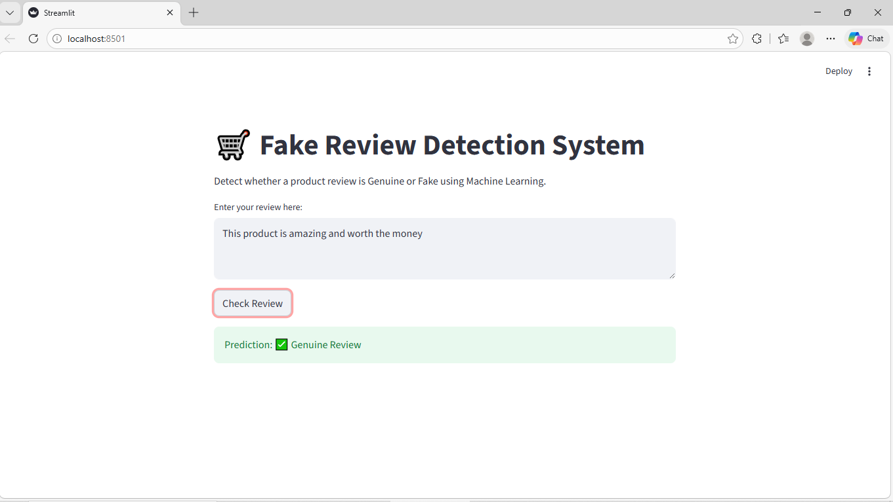

# Fake Review Detection using Machine Learning

This project detects fake product reviews using Natural Language Processing (NLP) and Machine Learning.  
The model is trained using TF-IDF feature extraction and an SVM classifier, and a web app is created for real-time prediction.

## Project Overview
Online product reviews play an important role in customer decision-making. However, many fake reviews are generated to mislead users. This project identifies whether a review is genuine or fake using machine learning techniques.

## Features
- Data preprocessing and cleaning
- Text feature extraction using TF-IDF
- Machine Learning model using SVM
- Model evaluation (Accuracy, Confusion Matrix, Precision, Recall)
- Web application for real-time prediction

## Technologies Used
- Python
- Pandas
- NumPy
- Scikit-learn
- Natural Language Processing (NLP)

## Project Structure
Fake-Review-Detection
│
├── app/
│   └── app.py
│
├── data/
│   ├── raw/
│   └── processed/
│
├── models/
│
├── notebooks/
│
├── requirements.txt
└── README.md

## How to Run This Project

1. Install required libraries
pip install -r requirements.txt

2. Run the application
streamlit run app/app.py

## Project Demo

Below is the screenshot of the working Fake Review Detection web application.

